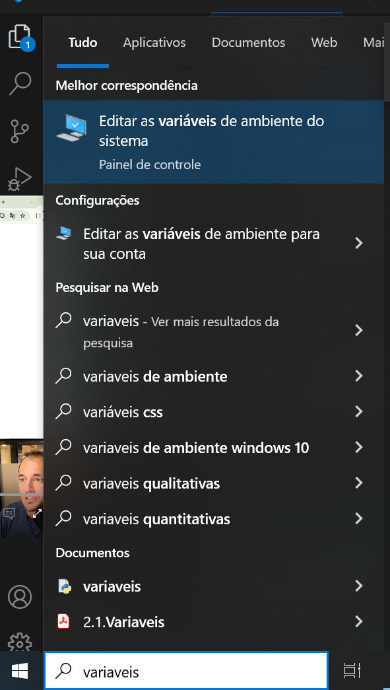
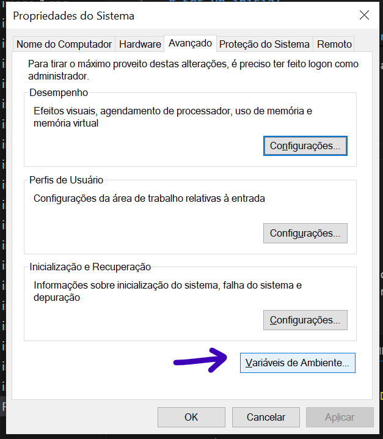
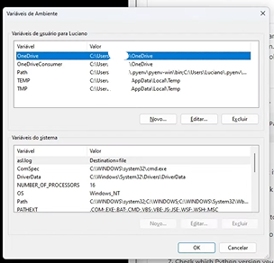
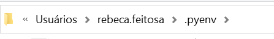
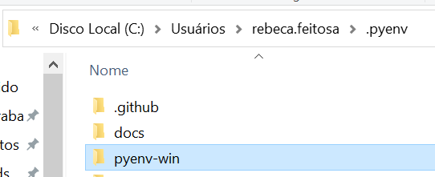
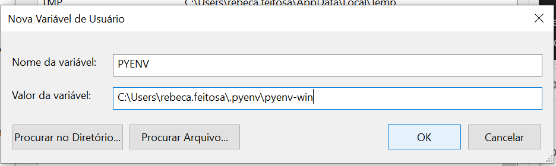
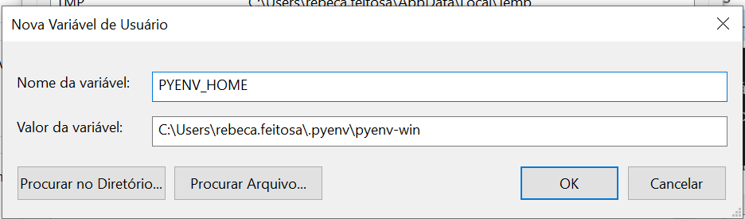
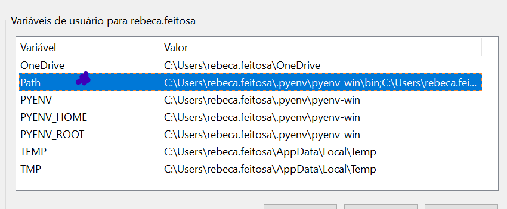
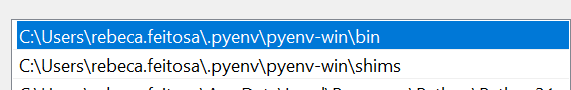

# Set Up inicial

## Configurando Pyenv

O Pyenv é uma ferramenta que ajuda a gerenciar diferentes versões do Python no seu computador. Digamos que você precise trabalhar em projetos que usam diferentes versões do Python, como um projeto que usa o Python 2.7 e outro que usa o Python 3.9. Em vez de instalar e desinstalar o Python toda vez que você precisa mudar de projeto, o Pyenv permite que você tenha várias versões do Python instaladas no mesmo computador e escolha qual versão usar para cada projeto. Ele facilita muito a vida de quem precisa lidar com diferentes ambientes de Python!

**Exemplo prático**

Imagine que temos dois projetos que estamos tocando: um usamos o streamlit baseado no python 3.11.5 e o outro projeto usamos o pandas baseado no python 3.12.1.

Como conseguimos trabalhar com 2 versões diferentes de python? usando o pyenv!!

**Como faço isso no meu computador?!**

### 1. Vamos instalar o pyenv nessa máquina!

_Importante notificar que estou usando o **windows** então esse guide vai funcionar apenas para esse sistema._

Para instalar o pyenv na máquina você precisa entrar na página do pyenv para windows nesse [link](https://github.com/pyenv-win/pyenv-win).

Role para baixo até achar essa parte de quick start: 

Você vai agora copiar esse código informado e rodar no Windows PowerShell:

Quando você roda esse código podem acontecer duas coisas: 

**a. Sucesso!!**

Vai aparecer um output assim após você rodar o código: 

**b. Erro ;(**

Isso vai ser tranquilo de resolver: 

Esse erro basicamente fala que não é possível carregar essa execução pois o script foi desabilitado no sistema.

Então o que eu faço? preciso autorizar o script de rodar esse tipo de comando (baixar algo de fora)

``Set-ExecutionPolicy -ExecutionPolicy RemoteSigned -Scope CurrentUser``

Depois disso vamos testar rodar o código de instalação do pyenv novamente: 

Se tudo correu bem, vai aparecer algo assim: 

_UFA!!_

**Agora vamos testar se funcionou?**

Agora é só fechar o PowerShell e abrir o Git Bash e rodar:

``pyenv --version``

Nisso de novo pode dar muito certo ou errado ;(
Mas calma, vamos resolver se tiver dado erro:

**Deu certo?**

E então o git vai retornar a versão de pyenv que temos na nossa máquina:

**Deu errado?**

Provavelmente apareceu algum erro na sua tela referente as variáveis de ambiente, certo?

Então vamos configurá-las:

a. Primeiro passo é abrir as variáveis de ambiente na sua máquina: 

b. Agora vamos adicionar todas as variáveis que não estão configuradas:

- Vamos entrar no gerenciador de arquivos e nos direcionar para a pasta do pyenv 

- Vamos localizar dentro da pasta de pyenv a pasta pyenv-win e copiar o endereço dela.

- No editor de variáveis de ambiente que vimos acima vamos em NOVO para adicionar esse endereço que copiamos a 3 variáveis:

- Além disso preciso adicionar dois PATHS:

_ps: precisa mover esses dois paths adicionados para cima conforme está na imagem_

**PRONTINHO**

Agora podemos voltar e fazer o teste:

``pyenv --version``

### 2. Configurando diferentes versões de python para cada projeto!

Em primeiro lugar, vamos verificar as versões de python na máquina: 

``pyenv versions``

Você vai perceber que ele não traz nada, então vou baixar as versões que preciso: 

``pyenv install 3.12.1``

Pronto!! você já baixou uma das versões do python que precisa. 
Agora você segue baixando a outra:

``pyenv install 3.11.5``

checando para ver se deu tudo certo: 

``pyenv versions``

Legal, agora você já instalou as versões necessárias e já pode configurar cada uma para cada projeto:

**a. Configurar uma versão global do python**

Vamos definir qual versão de python quero rodar globalmente (a versão que vai rodar caso eu não esteja rodando uma versão específica de um projeto).

Ainda no Git Bash rodamos esse script:

``pyenv global 3.12.1``

**b. Configurar uma versão específica do python para cada projeto**

Dentro da pasta que quero criar meus projetos, vou criar o projeto streamlit:

Então vou entrar nessa pasta que acabei de criar:

Rodo o seguinte script para definir a versão python para essa pasta:

E boa!! agora você tem uma versão diferente da sua versão de python global no seu projeto!

 